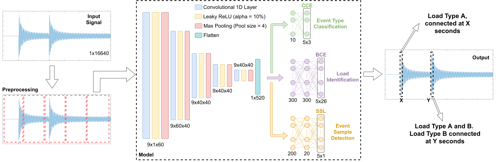

# DeepDFML-NILM

This repository is the official implementation of the paper [DeepDFML-NILM: A New CNN-Based Architecture for Detection, Feature Extraction and Multi-Label Classification in NILM Signals](https://ieeexplore.ieee.org/abstract/document/9611234). On this work, we propose a new CNN architecture to perform detection, feature extraction, and multi-label classification of loads, in non-intrusive load monitoring (NILM) approaches, with a single model for high-frequency signals. This model follows the idea of YOLO network, which provides the detection and multi-label classification of images. The obtained results are equivalent or superior (in most analyzed cases) to state-of-the-art methods for the evaluated datasets.



---

## Dependencies

The model was implemented on Python 3.8.6 with the following libraries:

- h5py (version 3.7.0):

    ```
    $ pip3 install h5py==3.7.0
    ```

- numpy (version 1.22.4):
    ```
    $ pip3 install numpy==1.22.4
    ```

- tqdm (version 4.64.0):
    ```
    $ pip3 install tqdm==4.64.0
    ```

- scikit-learn (version 1.1.1):
    ```
    $ pip3 install sklearn==1.1.1
    ```

- keras (version 2.7.0):
    ```
    $ pip3 install keras==2.7.0
    ```

- tensorflow (version 2.7.0):
    ```
    $ pip3 install tensorflow==2.7.0
    ```

- matplotlib (version 3.3.3):
    ```
    $ pip3 install matplotlib==3.3.3
    ```

---

## Dict structure

This implementation uses a dict structure to define some of the execution parameters. The fields of this dict are:

* `N_GRIDS`: Total positions of the grid (default = 5).
* `N_CLASS`: Total of loads on the dataset (default = 26).
* `SIGNAL_BASE_LENGTH`: Total of mapped samples on each signal cut (default = 12800, 50 electrical network cycles).
* `AUGMENTATION_RATIO`: Augmentation ratio. In case this value is greater than 1, the program will generate more cuts for the same event applying a different offset on the window (default = 1). (Deprecated)
* `MARGIN_RATIO`: Size of the unmapped margins defined by a portion of the signal. (default = 0.15).
* `USE_NO_LOAD`: Flag to indicated if the appliance "NO LOAD" must be considered. (Deprecated)
* `DATASET_PATH`: Path to the .hdf5 file containing the samples.
* `TRAIN_SIZE`: Ratio of the examples used for training (default = 0.8). (Only used if the kfold is not performed)
* `FOLDER_PATH`: Path to the folder where the model shall be stored.
* `FOLDER_DATA_PATH`: Path to the *.p files with the already processed data. Usually it's the same that FOLDER_PATH.
* `N_EPOCHS_TRAINING`: Total of epochs for training. (default = 250)
* `INITIAL_EPOCH`: Initial epoch to continue a training, only useful if a training will be continued. (default = 0).
* `TOTAL_MAX_EPOCHS`: Max of training epochs.
* `SNRdB`: Noise level on dB.

---

## Trained weights

The trained weights may be downloaded from this [link](https://drive.google.com/file/d/18lcnLgRms-Sb_AovSSFTFTPKWgKu5V8Y/view?usp=sharing). To use them, just download and place the `TrainedWeights` folder inside the `DeepDFML-NILM` directory.

---

## Dataset Waveforms

The LIT-Dataset is a public dataset and can be downloaded on this [link](http://dainf.ct.utfpr.edu.br/~douglas/LIT_Dataset/index.html). However, only MATLAB tools are provided. In order to use the dataset with this implementation, an version on *.hdf5 can be downloaded on the following [link](https://drive.google.com/file/d/10NL9S8BYioj1U1_phCEoKX4WWRQoBuYW/view?usp=sharing). The dataset is stored on this file on the following hierarchical structure:

- `1` -> Total number of loads on each waveform
    - `i` -> Array containing all the samples for each waveform
    - `events` -> Array containing the events array. Each event array has the same length of the waveform. If a position has a 0, there is no event. If it has a 1, there is an ON event on the sample with the same index and if it has a -1, there is an OFF event.
    - `labels` -> Array of connected loads. The connected loads for each waveform are represented by an array with the labels of the connected loads in the order of the events. So, if there is only one appliance, the array shall look like: ["A", "A"].
- `2`
    - `i`
    - `events`
    - `labels`
- `3`
    - `i`
    - `events`
    - `labels`
- `8`
    - `i`
    - `events`
    - `labels`

To use this file with this implementation, just download it and place the `Synthetic_Full_iHall.hdf5` file on the `DeepDFML-NILM` directory.

---

## How to run

To train, just install all dependencies, configure the dict structure on the file `src/main.py` and run it as follows:

```
$ cd src
$ python3 main.py
```

Also, on the folder `notebooks` there are a few notebooks for evaluation of the models and some visualization tests.

## Tests on Jetson TX1

The tests on Jetson TX1 are detailed on this [tutorial](EmbeddedSystem.md).

---

## Cite

If this work helped you somehow, here is a way to cite it:

```
@ARTICLE{Nolasco2022,
  author={Nolasco, Lucas da Silva and Lazzaretti, André Eugenio and Mulinari, Bruna Machado},
  journal={IEEE Sensors Journal}, 
  title={DeepDFML-NILM: A New CNN-Based Architecture for Detection, Feature Extraction and Multi-Label Classification in NILM Signals}, 
  year={2022},
  volume={22},
  number={1},
  pages={501-509},
  doi={10.1109/JSEN.2021.3127322}}
```
